# 📋 CRUD With OpenSpec

<div align="center">


**A modern CRUD application demonstrating spec-driven development with OpenSpec**

[Getting Started](#-getting-started) •
[Features](#-features) •
[Documentation](#-openspec-workflow) •
[Contributing](#-contributing)

</div>

---

## 🎯 Project Overview

This project showcases a **production-ready CRUD application** built with **ASP.NET Core (.NET 8)** and **Entity Framework Core**, leveraging the power of **spec-driven development** through **OpenSpec**.

### What is Spec-Driven Development?

Instead of diving straight into code, this approach ensures alignment between requirements, design, and implementation:

```mermaid
graph LR
    A[📝 Propose] --> B[⚡ Implement]
    B --> C[📦 Archive]
    C --> A
    style A fill:#e1f5ff
    style B fill:#fff4e1
    style C fill:#e8f5e9
```



1. **📝 Propose** – Define requirements and changes as specifications
2. **⚡ Implement** – Develop features based on approved specs
3. **📦 Archive** – Preserve completed changes as living documentation

This methodology delivers **clarity**, **traceability**, and **long-term maintainability**.

---

## ✨ Features

- ✅ **Full CRUD Operations** via ASP.NET Core Web API
- 🗄️ **Entity Framework Core** for seamless data access
- 🔐 **SQL Server** database with SSMS management
- 📚 **Spec-Driven Development** using OpenSpec
- 📖 **Living Documentation** that evolves with your code
- 🧪 **Testable Architecture** with separation of concerns

---

## 🛠️ Tech Stack

<table>
<tr>
<td align="center" width="25%">
<br />
<b>.NET 8</b><br />
Backend Framework
</td>
<td align="center" width="25%">
<br />
<b>EF Core</b><br />
ORM Layer
</td>
<td align="center" width="25%">
<br />
<b>SQL Server</b><br />
Database
</td>
<td align="center" width="25%">
<br />
<b>OpenSpec</b><br />
Spec Management
</td>
</tr>
</table>

### Development Tools

| Tool | Purpose |
|------|---------|
| **Visual Studio / Rider** | Primary IDE |
| **SSMS** | Database Management |
| **Postman / Swagger** | API Testing |
| **Git** | Version Control |

---

## 📁 Repository Structure

```plaintext
CRUD-With-OpenSpec/
│
├── 📂 openspec/
│   ├── specs/                 # Active specifications
│   ├── changes/               # Proposed and approved changes
│   └── AGENTS.md              # AI / agent guidance
│
├── 📂 src/
│   ├── Controllers/           # API controllers
│   ├── Models/                # Entity models
│   ├── Data/                  # DbContext and EF configurations
│   ├── Services/              # Business logic layer
│   └── Program.cs             # Application entry point
│
├── 📂 tests/                  # Unit / integration tests
│
├── appsettings.json           # Configuration and DB connection
├── .gitignore
└── README.md                  # You are here! 📍
```

---

## 🚀 Getting Started

### Prerequisites

Before you begin, ensure you have the following installed:

- [ ] [.NET 8 SDK](https://dotnet.microsoft.com/download/dotnet/8.0)
- [ ] [SQL Server](https://www.microsoft.com/en-us/sql-server/sql-server-downloads)
- [ ] [SQL Server Management Studio (SSMS)](https://docs.microsoft.com/en-us/sql/ssms/download-sql-server-management-studio-ssms)
- [ ] [Node.js](https://nodejs.org/) (for OpenSpec CLI)

### Installation

#### 1️⃣ Clone the Repository

```bash
git clone https://github.com/Jinushi-Rajapaksha/CRUD-With-OpenSpec.git
cd CRUD-With-OpenSpec
```

#### 2️⃣ Install OpenSpec CLI

```bash
npm install -g @fission-ai/openspec@latest
```

#### 3️⃣ Initialize OpenSpec

```bash
openspec init
```

#### 4️⃣ Configure Database Connection

Update your `appsettings.json` with your SQL Server connection string:

```json
{
  "ConnectionStrings": {
    "DefaultConnection": "Server=localhost;Database=CrudWithOpenSpec;Trusted_Connection=True;TrustServerCertificate=True;"
  }
}
```

> 💡 **Tip:** Create the database in SSMS before running migrations if it doesn't exist.

#### 5️⃣ Apply Database Migrations

```bash
dotnet ef database update
```

#### 6️⃣ Run the Application

```bash
dotnet run
```

Your API should now be running at `https://localhost:5001` (or as configured).

---

## 🔧 OpenSpec Workflow

This project follows a **spec-driven workflow** using OpenSpec to maintain alignment between documentation and implementation.

### Core Commands

| Command | Description | Usage |
|---------|-------------|-------|
| `openspec list` | View current specifications and changes | Review project state |
| `openspec validate` | Validate implementation against specs | Ensure spec compliance |
| `/openspec:proposal` | Create a new change proposal | Start new feature/change |
| `/openspec:apply` | Implement an approved proposal | Apply approved changes |
| `/openspec:archive` | Archive completed changes | Document completed work |

### Workflow Example

```bash
# 1. List current specs
openspec list

# 2. Create a proposal for a new feature
# (Use in your AI assistant or IDE)
/openspec:proposal

# 3. Validate your implementation
openspec validate

# 4. Archive completed work
/openspec:archive
```

---

## 📚 API Endpoints

Once running, your API will expose the following endpoints:

| Method | Endpoint | Description |
|--------|----------|-------------|
| `GET` | `/api/[resource]` | Get all items |
| `GET` | `/api/[resource]/{id}` | Get item by ID |
| `POST` | `/api/[resource]` | Create new item |
| `PUT` | `/api/[resource]/{id}` | Update existing item |
| `DELETE` | `/api/[resource]/{id}` | Delete item |

> 📝 Access Swagger UI at `/swagger` for interactive API documentation.

---

## 👤 Author

**Jinushi Rajapaksha**

- GitHub: [@Jinushi-Rajapaksha](https://github.com/Jinushi-Rajapaksha)
- LinkedIn: [Connect with me](https://www.linkedin.com/in/jinushi-rajapaksha/)

---

## 🌟 Show Your Support

If you find this project helpful, please consider giving it a ⭐️!

---

<div align="center">

**[⬆ Back to Top](#-crud-with-openspec)**

Made with ❤️ using ASP.NET Core and OpenSpec

</div>
